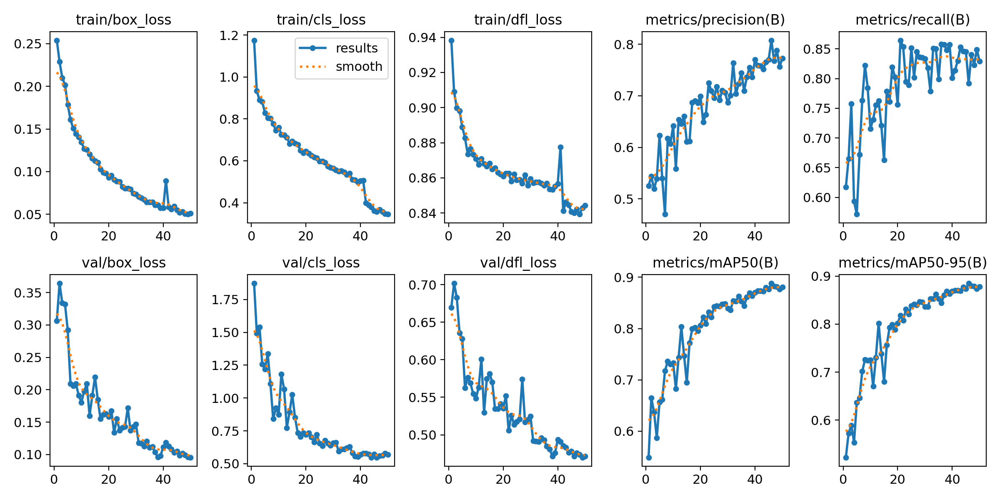
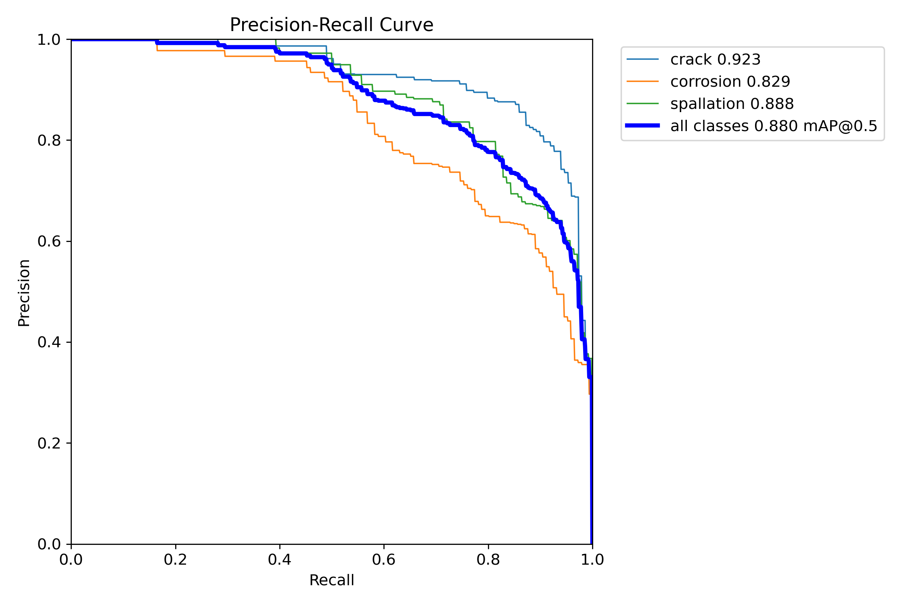
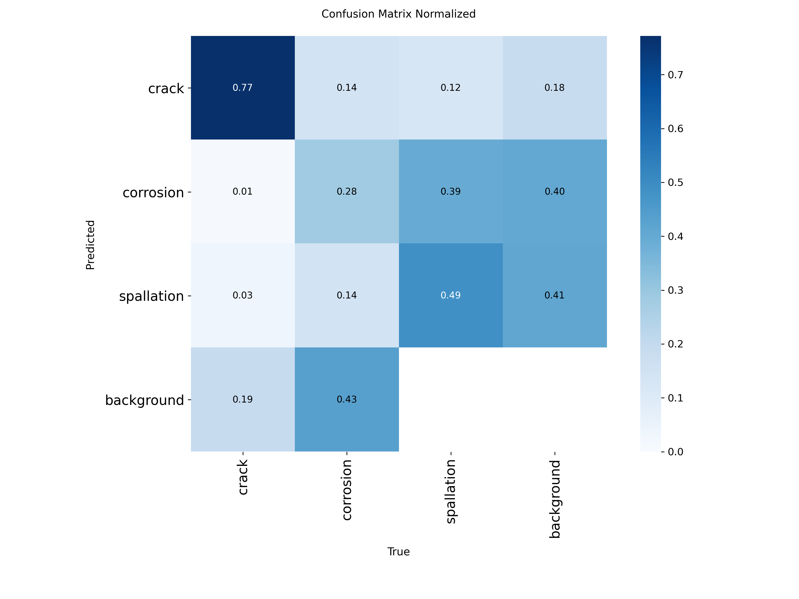

# Autonomous Drone Infrastructure Inspector

A simulation-based autonomous UAV system that uses deep learning to detect structural defects — cracks, corrosion, and spallation — in real time using YOLOv8 and ROS 2.

---

## Project Overview

Traditional infrastructure inspection relies on manual labor, visual inspection, and expensive equipment — methods that are time-consuming, dangerous, and prone to human error. This project automates the inspection process by integrating a simulated UAV with a deep learning computer vision pipeline capable of identifying structural defects in real time.

The system was developed entirely in simulation using Gazebo Harmonic and PX4 SITL, with a ROS 2 Jazzy node architecture connecting the drone's camera feed to a trained YOLOv8 detection model.

---

## Demo

> Gazebo simulation with drone, wall structure, and live ROS 2 camera-to-YOLO pipeline running at ~1 Hz.





---

## Model Performance

| Metric | Value |
|--------|-------|
| mAP@0.50 | **0.880** |
| F1 Score (best) | 0.79 @ conf 0.569 |
| Crack AP | 0.923 |
| Corrosion AP | 0.829 |
| Spallation AP | 0.888 |

Trained on **3,092 labeled images** from the CODEBRIM balanced dataset using YOLOv8s on a Google Colab T4 GPU over 50 epochs.

---

## System Architecture

```
Gazebo Harmonic (simulation)
        ↕
   PX4 SITL (flight controller)
        ↕
  ros_gz_bridge (camera bridge)
        ↕
   ROS 2 Jazzy
        ↕
  YOLO Detection Node
  (subscribes to /camera/image → runs inference → publishes /detection/image)
```

---

## Pipeline Stages

| Stage | Description | Status |
|-------|-------------|--------|
| 1 | Data collection & preparation | ✅ Complete |
| 2 | YOLOv8 model training | ✅ Complete |
| 3 | Simulation environment setup | ✅ Complete |
| 4 | ROS 2 camera-to-YOLO integration | ⚠️ Partial |
| 5 | Defect localization & reporting | 🔲 Future work |

---

## Tech Stack

| Component | Technology |
|-----------|------------|
| Simulation | Gazebo Harmonic 8.11.0 |
| Flight controller | PX4 SITL |
| Robotics middleware | ROS 2 Jazzy |
| Object detection | YOLOv8s (Ultralytics) |
| Training hardware | Google Colab T4 GPU |
| OS | Ubuntu 24.04 (WSL2) |
| Language | Python 3.12 |

---

## Dataset

**CODEBRIM** (Concrete Defect Bridge Image Dataset) — balanced version

- 3 defect classes: `crack`, `corrosion`, `spallation`
- Train: 3,092 matched image-label pairs
- Val: 340 matched pairs
- Test: 339 matched pairs
- Annotations converted from XML multi-label classification format to YOLO bounding box format using a custom Python script

> Dataset available at: [CODEBRIM on Zenodo](https://zenodo.org/record/2620293)

---

## Installation & Setup

### Prerequisites

- Ubuntu 24.04 (native or WSL2)
- ROS 2 Jazzy
- Gazebo Harmonic
- PX4-Autopilot
- Python 3.12

### 1. Clone the repository

```bash
git clone https://github.com/TBarr2003/autonomous-drone-inspector.git
cd autonomous-drone-inspector
```

### 2. Install ROS 2 dependencies

```bash
sudo apt install -y ros-jazzy-desktop ros-jazzy-mavros ros-jazzy-mavros-extras ros-jazzy-ros-gz-bridge
pip3 install ultralytics opencv-python --break-system-packages
pip3 install "numpy<2" --break-system-packages
```

### 3. Build the ROS 2 workspace

```bash
cd drone_ws
colcon build
source install/setup.bash
```

### 4. Download model weights

Download `best.pt` from Google Drive and place it at:
```
~/drone_inspection/weights/best.pt
```

> [Download best.pt](https://drive.google.com/drive/folders/your-folder-link-here) ← replace with your actual Drive link

---

## Running the System

### Step 1 — Launch Gazebo + PX4

```bash
export GZ_CONFIG_PATH=/usr/share/gz
export GZ_SIM_RESOURCE_PATH=/home/$USER/PX4-Autopilot/Tools/simulation/gz/models
cd ~/PX4-Autopilot
make px4_sitl gz_x500_mono_cam
```

### Step 2 — Spawn inspection wall

```bash
python3 scripts/spawn_wall.py
```

### Step 3 — Launch camera bridge

```bash
source /opt/ros/jazzy/setup.bash
export GZ_CONFIG_PATH=/usr/share/gz
BRIDGE_TOPIC="/world/default/model/x500_mono_cam_0/link/camera_link/sensor/camera/image"
ros2 run ros_gz_bridge parameter_bridge ${BRIDGE_TOPIC}@sensor_msgs/msg/Image@gz.msgs.Image
```

### Step 4 — Launch YOLO detection node

```bash
source /opt/ros/jazzy/setup.bash
source ~/drone_ws/install/setup.bash
ros2 run drone_inspection yolo_detection_node
```

### Step 5 — View detections

```bash
source /opt/ros/jazzy/setup.bash
ros2 run rqt_image_view rqt_image_view
# Select /detection/image from the dropdown
```

### Step 6 — Take off

At the `pxh>` prompt in Terminal 1:
```
commander takeoff
```

---

## Training

The Colab training notebook is available at `training/drone_inspection_yolov8.ipynb`.

Training configuration (from `args.yaml`):
- Model: `yolov8s.pt` (pretrained on COCO)
- Epochs: 50
- Batch size: 16
- Image size: 640×640
- Optimizer: AdamW
- LR: 0.001 with cosine scheduler
- Augmentation: mosaic, flip, scale, HSV shifts

---

## Known Limitations

**Domain gap** — The model was trained on real close-up bridge photos. The simulated Gazebo environment uses plain colored surfaces without realistic textures, so live defect detections do not trigger in simulation. This is a well-documented sim-to-real transfer challenge in UAV inspection literature.

**Camera orientation** — The x500_mono_cam drone mounts the camera in a downward-facing configuration, limiting its field of view toward vertical structures.

**Inference speed** — Running on CPU in WSL2 limits inference to ~1 Hz. A GPU-enabled edge device (e.g. NVIDIA Jetson) would be required for real-time deployment.

---

## Future Work

- Synthetic defect textures in Gazebo to close the domain gap
- MAVROS-based autonomous navigation reacting to detections
- GPS-tagged defect localization and 2D defect map generation
- Real hardware deployment on a physical drone with Jetson edge compute
- Expanded training with UAV-perspective aerial imagery

---

## References

1. Due, T. et al. "A Pavement Crack Detection and Evaluation Framework for UAV Inspection." *Sensors*, 23(7), 3418, 2023.
2. Bader, S. et al. "Automatic Crack Segmentation for UAV-Assisted Bridge Inspection." *Electronics*, 2022.
3. Ren, Y. et al. "Automatic Bridge Crack Detection Using UAV and Faster R-CNN." *Applied Sciences*, 2021.
4. Redmon, J. et al. "YOLO-Based Deep Learning Models for UAV Bridge Inspection." 2023.
5. Mundt, M. et al. "CODEBRIM: Concrete Defect Bridge Image Dataset." Zenodo, 2019.

---

## Author

**Tristan Barrera** — Rowan University
